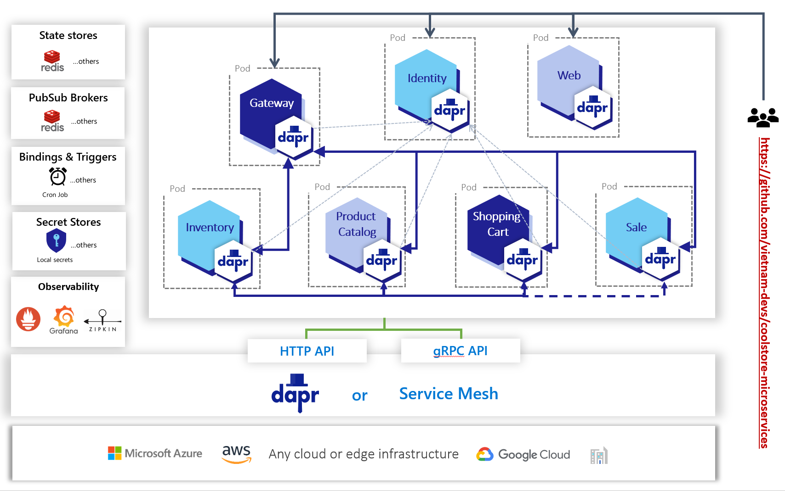
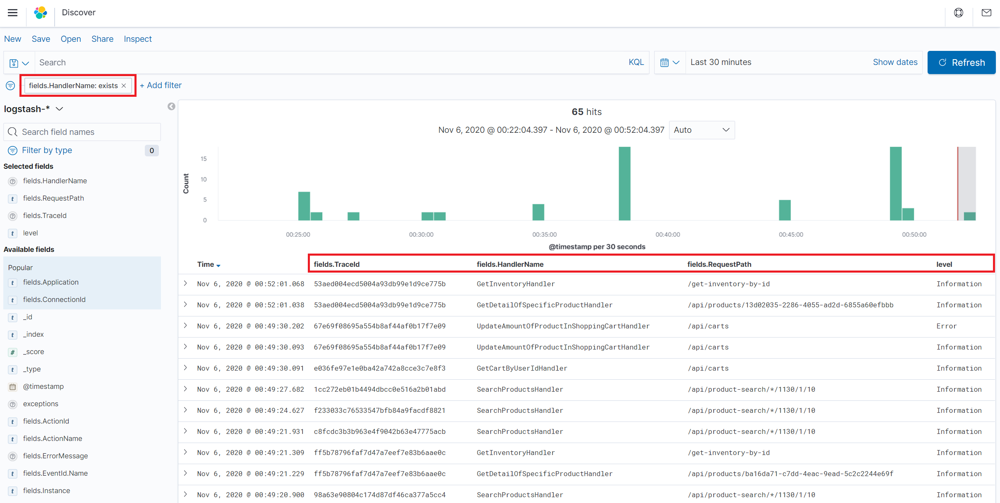

# CoolStore Web Application - :ferris_wheel: Modern Application on Dapr and Tye :sailboat:


[](https://gitpod.io/#https://github.com/vietnam-devs/coolstore-microservices)
[](https://github.com/vietnam-devs/coolstore-microservices/blob/master/LICENSE)

CoolStore Website is a containerised microservices application consisting of services based on .NET Core running on Dapr. It demonstrates how to wire up small microservices into a larger application using microservice architectural principals.

> This repository based on some of the old libraries. So be careful if you use it in your production environment!!!
>
> We are working on [practical-clean-ddd](https://github.com/thangchung/practical-clean-ddd) for the new version of building the .NET apps with domain-driven design, clean architecture with Docker, Kubernetes, Tye, and Dapr in a practical way 👍

Read [documentation](https://vietnam-devs.github.io/coolstore-microservices) for more information.

The business domain is inspired from [CoolStore project](https://github.com/jbossdemocentral/coolstore-microservice) by [JBoss Demo Central](https://github.com/jbossdemocentral) and [Red Hat Demo Central](https://gitlab.com/redhatdemocentral).

Check out my [medium](https://medium.com/@thangchung), or my [dev.to](https://dev.to/thangchung) or say hi on [Twitter](https://twitter.com/thangchung)!

# Table of contents

- [Dapr Building Blocks](https://github.com/vietnam-devs/coolstore-microservices#dapr-building-blocks)
- [Screenshots](https://github.com/vietnam-devs/coolstore-microservices#screenshots)
- [Try it!](https://github.com/vietnam-devs/coolstore-microservices#try-it)
- [OS, SDK, library, tooling and prerequisites](https://github.com/vietnam-devs/coolstore-microservices#os-sdk-library-tooling-and-prerequisites)
- [µService development](https://github.com/vietnam-devs/coolstore-microservices#µmicroservice-development)
- [Open API](https://github.com/vietnam-devs/coolstore-microservices#open-api)
- [CI/CD](https://github.com/vietnam-devs/coolstore-microservices#ci-cd)
- [Public presentation](https://github.com/vietnam-devs/coolstore-microservices#public-presentation)
- [Contributing](https://github.com/vietnam-devs/coolstore-microservices#contributing)
- [Contributors](https://github.com/vietnam-devs/coolstore-microservices#contributors)
- [Licence](https://github.com/vietnam-devs/coolstore-microservices#licence)

## Dapr Building Blocks



<table>
  <thead>
    <th>Name</th>
    <th>Usecase</th>
    <th>Apps Participants</th>
  </thead>
  <tbody>
    <tr>
      <td><b>Service-to-service invocation</b></td>
      <td>
         - User clicks to the detail product<br>
         - Populate product information for shopping cart items<br>
         - Order gets detail information of buyer
      </td>
      <td>productcatalogapp, inventoryapp, shoppingcartapp, identityapp</td>
    </tr>
    <tr>
      <td><b>State management</b></td>
      <td>Items in the shopping cart</td>
      <td>shoppingcartapp</td>
    </tr>
    <tr>
      <td><b>Publish and subscribe</b></td>
      <td>User clicks checkout button, and the checkout process happens. It triggers the pub/sub flow in the system</td>
      <td>shoppingcartapp, saleapp, identityapp</td>
    </tr>
    <tr>
      <td><b>Resource bindings</b></td>
      <td>Every 30 seconds and 1 minutes the validation process happens. It will change the status of order from Received to Process and Complete via Cron binding</td>
      <td>productcatalogapp, inventoryapp</td>
    </tr>
    <tr>
      <td><b>Observability</b></td>
      <td>All apps in the application are injected by daprd so that it's tracked and observed by dapr </td>
      <td>identityapp, webapigatewayapp, inventoryapp, productcatalogapp, shoppingcartapp, saleapp, web</td>
    </tr>
    <tr>
      <td><b>Secrets</b></td>
      <td>Bind with local secret file to hide password of redis</td>
      <td>inventoryapp, productcatalogapp, shoppingcartapp, saleapp</td>
    </tr>
    <tr>
      <td><b>Actors</b></td>
      <td>N/A</td>
      <td>N/A</td>
    </tr>
  </tbody>
</table>

## Screenshots

### Home page


### Shopping Cart page


### Order page


## Try it

Make sure you have [`dapr`](https://docs.dapr.io/getting-started/install-dapr/) and [`tye`](https://github.com/dotnet/tye/blob/master/docs/getting_started.md) installed on your machine!

### Only wanna see wth is it?

```
$ tye run
```

Go to [`http://localhost:8000`](http://localhost:8000), and you're able to access to several endpoints whenevever it's ready as below:

- Web App: [`http://localhost:3000`](http://localhost:3000)
- Web Api Gateway: [`http://localhost:5000`](http://localhost:5000)
- Identity Server: [`http://localhost:5001`](http://localhost:5001)

### Wanna go deeply to see how can we built it!

1. Start core components

```
$ tye run tye.slim.yaml
```

2. Start dapr apps locally via dapr cli

```
$ dapr run --app-port 5001 --app-id identityapp dotnet run -- -p src\Services\Identity\IdentityService\IdentityService.csproj
```

```
$ dapr run --app-port 5002 --app-id inventoryapp dotnet run -- -p src\Services\Inventory\InventoryService.Api\InventoryService.Api.csproj
```

```
$ dapr run --app-port 5003 --app-id productcatalogapp dotnet run -- -p src\Services\ProductCatalog\ProductCatalogService.Api\ProductCatalogService.Api.csproj
```

```
$ dapr run --app-port 5004 --app-id shoppingcartapp dotnet run -- -p src\Services\ShoppingCart\ShoppingCartService.Api\ShoppingCartService.Api.csproj
```

Now, you can start to develop, debug or explore more about `dapr` with `tye` via Coolstore Apps.

> Enable `vm.max_map_count` for ElasticSearch via run `sysctl -w vm.max_map_count=262144`

## OS, SDK, library, tooling and prerequisites

### Infrastructure

- **`Windows 10`** - The OS for developing and building this demo application.
- **[`WSL2 - Ubuntu OS`](https://docs.microsoft.com/en-us/windows/wsl/install-win10)** - the subsystem that helps to run easily the bash shell on Windows OS
- **[`Docker for desktop (Kubernetes enabled)`](https://www.docker.com/products/docker-desktop)** - The easiest tool to run Docker, Docker Swarm and Kubernetes on Mac and Windows
- **[`Kubernetes`](https://kubernetes.io) / [`AKS`](https://docs.microsoft.com/en-us/azure/aks)** - The app is designed to run on Kubernetes (both locally on "Docker for Desktop" as well as on the cloud with AKS)
- **[`helm`](https://helm.sh)** - Best package manager to find, share, and use software built for Kubernetes
- **[`dapr`](https://dapr.io/)** - An event-driven, portable runtime for building microservices on cloud and edge
- **[`tye`](https://github.com/dotnet/tye)** - A developer tool that makes developing, testing, and deploying microservices and distributed applications easier

### Back-end

- **[`.NET Core 5`](https://dotnet.microsoft.com/download)** - .NET Framework and .NET Core, including ASP.NET and ASP.NET Core
- **[`IdentityServer4`](https://identityserver.io)** - Identity and Access Control solution for .NET Core
- **[`YARP`](https://github.com/microsoft/reverse-proxy)** - A toolkit for developing high-performance HTTP reverse proxy applications
- **[`FluentValidation`](https://github.com/FluentValidation/FluentValidation)** - Popular .NET validation library for building strongly-typed validation rules
- **[`MediatR`](https://github.com/jbogard/MediatR)** - Simple, unambitious mediator implementation in .NET
- **[`EF Core`](https://github.com/dotnet/efcore)** - Modern object-database mapper for .NET. It supports LINQ queries, change tracking, updates, and schema migrations
- **[`Scrutor`](https://github.com/khellang/Scrutor)** - Assembly scanning and decoration extensions for Microsoft.Extensions.DependencyInjection
- **[`serilog`](https://github.com/serilog/serilog)** - Simple .NET logging with fully-structured events
- **[`NEST`](https://github.com/elastic/elasticsearch-net)** - Elasticsearch.Net & NEST

### Front-end

- **[`nodejs 10.x`](https://nodejs.org/en/download)** - JavaScript runtime built on Chrome's V8 JavaScript engine
- **[`typescript`](https://www.typescriptlang.org)** - A typed superset of JavaScript that compiles to plain JavaScript
- **[`create-react-app`](https://facebook.github.io/create-react-app)** - A modern web app by running one command

## µService development

Guidance for developing µService can be found at [Clean Domain-Driven Design in 10 minutes](https://medium.com/@thangchung/clean-domain-driven-design-in-10-minutes-6037a59c8b7b)


## Open API


https://documenter.getpostman.com/view/4847807/SVmvUeZv?version=latest#9f5ed7e4-e855-46e5-a42d-64edb31bc1cb

## CI/CD


## Debug and Tracing Apps

- Setup Kibana with `TraceId`, `HandlerName`, `RequestPath`, `level` and filter with `HandlerName`



Then, you can find the exception happend in code via Kibana dashboard with settings above. Grab the `TraceId`, then paste it to `Zipkin` dashboard, then you can see the tracing of this request as the following picture


## Public presentation

- [Service Mesh on AKS, the future is now - Microsoft Build event in May 2019](https://mybuild.techcommunity.microsoft.com/sessions/77172?source=TechCommunity)
- [From Microservices to Service Mesh - DevCafe event in July 2018](https://www.slideshare.net/ThangChung/from-microservices-to-service-mesh-devcafe-event-july-2018)
- [Service Mesh for Microservices- Vietnam Mobile Day event in June 2018](https://www.slideshare.net/ThangChung/service-mesh-for-microservices-vietnam-mobile-day-june-2017)
- [Avoid SPOF in Cloud-native Apps - Vietnam Web Summit event in December 2018](https://www.slideshare.net/ThangChung/avoid-single-point-of-failure-in-cloud-native-application)

## Contributing

1. Fork it!
2. Create your feature branch: `git checkout -b my-new-feature`
3. Commit your changes: `git commit -am 'Add some feature'`
4. Push to the branch: `git push origin my-new-feature`
5. Submit a pull request :p

## Contributors ✨

Thanks goes to these wonderful people ([emoji key](https://allcontributors.org/docs/en/emoji-key))

<table>
  <tbody>
    <tr>
      <td align="center" valign="top">
        
        <br>
        <a href="https://github.com/thangchung">Thang Chung</a>
        <p>
          <a href="https://github.com/vietnam-devs/coolstore-microservices/commits?author=thangchung" title="Developer">💻</a>
          <a href="#question" title="Answering Questions">💬</a>
          <a href="#docs" title="Documentation">📖</a>
          <a href="#review" title="Reviewed Pull Requests">👀</a>
          <a href="#infra" title="Infrastructure">🚇</a>
          <a href="#maintance" title="Maintenance">🚧</a>
        </p>
      </td>
      <td align="center" valign="top">
        
        <br>
        <a href="https://github.com/tungphuong">Phuong Le</a>
        <p>
          <a href="https://github.com/vietnam-devs/coolstore-microservices/commits?author=tungphuong" title="Developer">💻</a>
          <a href="#package" title="Packaging">📦</a>
          <a href="#infra" title="Infrastructure">🚇</a>
        </p>
      </td>
      <td align="center" valign="top">
        
        <br>
        <a href="https://github.com/trumhemcut">Phi Huynh</a>
        <p>
          <a href="#idea" title="Ideas & Planning">🤔</a>
          <a href="https://github.com/vietnam-devs/coolstore-microservices/commits?author=trumhemcut" title="Infrastructure">🚇</a>
        </p>
      </td>
      <td align="center" valign="top">
        
        <br>
        <a href="https://github.com/thinhnotes">Thinh Nguyen</a>
        <p>
          <a href="https://github.com/vietnam-devs/coolstore-microservices/commits?author=thinhnotes" title="Developer">💻</a>
          <a href="#maintance" title="Maintenance">🚧</a>
        </p>
      </td>
      <td align="center" valign="top">
        
        <br>
        <a href="https://github.com/stuartleeks">Stuart Leeks</a>
        <p>
          <a href="#docs" title="Documentation">📖</a>
        </p>
      </td>
     </tr>
  </tbody>
</table>

## Licence

Code released under [the MIT license](https://github.com/vietnam-devs/coolstore-microservices/blob/master/LICENSE).
