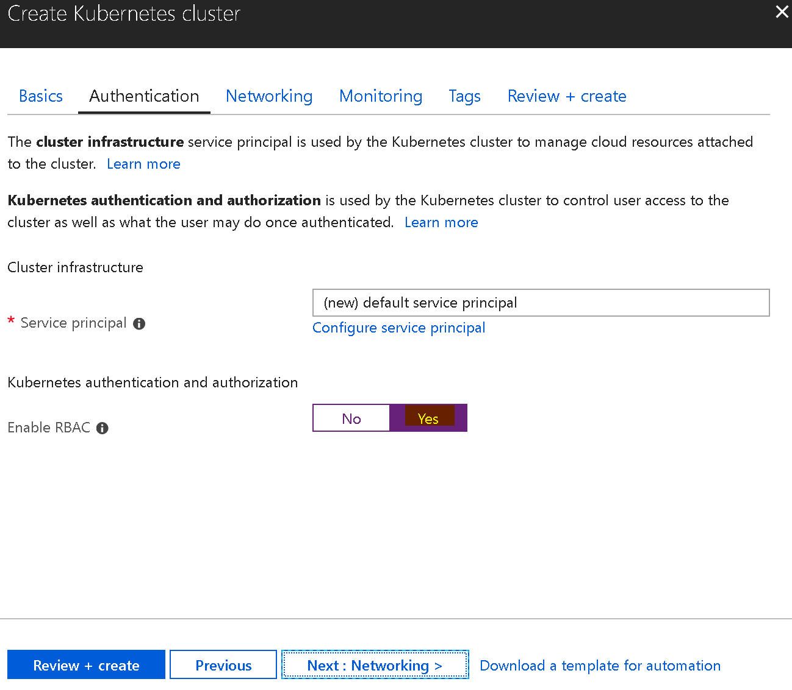

# Up and running manually on Docker for desktop and AKS

## Docker for desktop

### Step 1

Make sure we have **`Docker for Desktop`** running with **`Kubernetes`** option enabled. We need to install **`kubectl`**, **`helm`** and **`istioctl`** on the build machine as well.

### Step 2

From current console, type `bash` to enter `Linux Subsystem (Ubuntu)`

### Step 3

Then `cd` into your root of project

```bash
$ ./deploys/scripts/build-images.sh
```

It should run and package all docker images.

_**Notes**_: it normally takes around 20 minutes for the first time

### Step 4

Download and install [istio-1.1.1](https://github.com/istio/istio/releases/tag/1.1.1) on the box, and unzip it into somewhere, then initialize it with following commands

```bash
$ cd <istio-1.1.1 path>
$ kubectl create -f install/kubernetes/helm/helm-service-account.yaml
$ helm init --service-account tiller --upgrade
$ helm install install/kubernetes/helm/istio --name istio --namespace istio-system
```

More information about installing `istio` can be found at https://istio.io/docs/setup/kubernetes/helm-install

### Step 5

Apply `istioctl` command to `coolstore` chart (please create k8s folder in folder deploys)

```bash
$ helm template deploys/charts/coolstore -f deploys/charts/coolstore/values.dev.yaml > deploys/out/coolstore.local.yaml
$ istioctl kube-inject -f deploys/out/coolstore.local.yaml | kubectl apply -f -
```

### Step 6

Add hosts file with following content

```
127.0.0.1 api.coolstore.local
127.0.0.1 id.coolstore.local
127.0.0.1 coolstore.local
127.0.0.1 backoffice.coolstore.local
```

Waiting for the container provision completed

### Step 7

Install `coolstore-istio` chart

```bash
$ helm install deploys\charts\coolstore-istio --name coolstore-istio
```

### Step 8

Install `envoy-proxy` stuffs for routing directly from Rest to internal gRPC services

```bash
$ kubectl apply -f deploys\k8s\istio-sidecar-injector.yaml
$ kubectl apply -f deploys\k8s\envoy-filter.yaml
```

### Step 9

Access to following URLs

```bash
$ curl -I http://coolstore.local # website
$ curl -I http://backoffice.coolstore.local # backoffice website
$ curl -I http://api.coolstore.local # api gateway
$ curl -I http://id.coolstore.local # identity provider
```

### Step 10

Clean up `coolstore` chart as

```bash
$ kubectl delete -f deployment/istio/coolstore.local.yaml
$ helm delete coolstore-istio --purge
$ helm delete istio --purge
```

**_Notes_**:

- Global path: set `PATH` for `docker`, `kubectl`, `helm`, and `istioctl`.

- Run with Nginx (not recommendation): if you want to run just only `Kubernetes` + `nginx-ingress` go to `deploys/charts/coolstore/values.yaml`, and modify as following

  ```bash
  nginx:
     enabled: true
  ```

  Then run the `helm` command as

  ```bash
  $ helm install --name cs-nginx stable/nginx-ingress
  ```

## Azure Kubernetes Service (AKS)

### Step 1: Install Docker for Windows and enable Kubernetes, Ubuntu WSL, kubectl, istioctl, helm and az

### Step 2: Create coolstore AKS, enabled RBAC. Minimum should have 3 nodes (istio pilot needs it)


And make sure checking to `enable RBAC` as following



Follow up with next steps to finish creating the cluster. It normally takes around `20 to 30 minutes`.

After it finished, we should be able to access to the `Kubernetes Dashboard` with following steps

```bash
$ az aks get-credentials --resource-group coolstore --name coolstore
$ kubectl proxy
```

But now, you will not be able to access to Kubernetes Dashboard. Then we need to add several steps then

```bash
$ kubectl create clusterrolebinding kubernetes-dashboard -n kube-system --clusterrole=cluster-admin --serviceaccount=kube-system:kubernetes-dashboard
```

Get the `token` subsequently

```bash
$ kubectl get secret \$(kubectl get serviceaccount kubernetes-dashboard -n kube-system -o jsonpath="{.secrets[0].name}") -n kube-system -o jsonpath="{.data.token}" | base64 --decode
```

Paste the token to login page as http://localhost:8001/api/v1/namespaces/kube-system/services/kubernetes-dashboard/proxy/#!/login

### Step 3: Install Istio on AKS

Due to some of the timeout issues for helm at now so that I couldn’t use helm to install, but `export` it to yaml file, then using kubectl to create it on AKS. `Download istio 1.0.0`, then upzip to somewhere on the machine. Following command to export and deploy it to AKS

```bash
$ helm template install/kubernetes/helm/istio --namespace istio-system > istio-dump.yaml
$ kubectl create -f istio-dump.yaml
$ kubectl create -f istio-dump.yaml
```

### Step 4: Install Coolstore on AKS

Get the `internal istio-ingress IP` by using

```bash
$ kubectl get services istio-ingressgateway -n istio-system -o=jsonpath={.spec.clusterIP}
```

Create the `values.aks.yaml` with content like

gateway:
ip: 10.0.106.82

Then run helm command

```bash
$ helm template deploys/charts/coolstore -f deploys/charts/coolstore/values.aks.yaml > deploys/k8s/dev-all-in-one.aks.yaml
```

Finally, we `inject sidecar` with this command

```bash
$ istioctl kube-inject -f deploys/k8s/dev-all-in-one.aks.yaml | kubectl apply -f -
```

### Step 5: Put mapping for hosts file

Get `external IP` on istio ingress by using

```bash
$ kubectl get svc -n istio-system
```

It should print out something like

```bash
...
istio-ingressgateway LoadBalancer 10.106.52.19 localhost 80:31380/TCP,443:31390/TCP,31400:31400/TCP,15011:32131/TCP,8060:30958/TCP,15030:31983/TCP,15031:30365/TCP 8d
...
```

Then, we only need to copy `10.106.52.19` to `C:\Windows\System32\drivers\etc\hosts` file as following

```bash
10.106.52.19 id.coolstore.aks
10.106.52.19 api.coolstore.aks
10.106.52.19 coolstore.aks
10.106.52.19 backoffice.coolstore.aks
```

From now on, we can access website at `http://coolstore.aks`, backoffice website at `http://backoffice.coolstore.aks`, identity provider at `http://id.coolstore.aks`, and api gateway at `http://api.coolstore.aks`

Let say we access to `http://api.coolstore.aks/oai/swagger/index.html`, then we should see


More information at https://hackernoon.com/5-steps-to-bring-coolstores-service-mesh-to-azure-kubernetes-service-aks-9cd1a5aa008a
